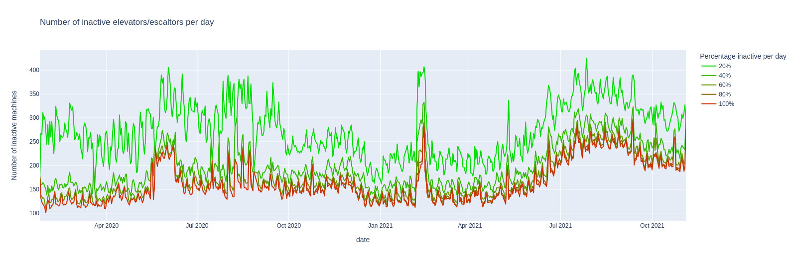

# Deutsche Bahn API History

There was this [monumental talk](https://media.ccc.de/v/36c3-10652-bahnmining_-_punktlichkeit_ist_eine_zier)
in late 2019 about the *correctness* of the punctuality statistics published by
Deutsche Bahn, which got me interested in [api.deutschebahn.com](https://api.deutschebahn.com).

This repo contains non of the train schedule data. Instead it has change-logs of the
[parking api](https://developer.deutschebahn.com/store/apis/info?name=BahnPark&version=v1&provider=DBOpenData),
[station data api](https://developer.deutschebahn.com/store/apis/info?name=StaDa-Station_Data&version=v2&provider=DBOpenData)
and the [station facilities status api](https://developer.deutschebahn.com/store/apis/info?name=FaSta-Station_Facilities_Status&version=v2&provider=DBOpenData)
(status of elevators and escalators), **collected since late January 2020**.
 

## Summary

### free parking lots
 
50 objects, 49,090 snapshots, 38,356 changes (2020-01-25T23:27:15 - 2021-11-06T23:15:01)

|     id | name                                                     |   num changes |
|-------:|:---------------------------------------------------------|--------------:|
| 100054 | Düren P1 Parkplatz Ludwig-Erhardt-Platz                  |          4125 |
| 100084 | Frankfurt (Main) Hbf Bustasche                           |          3434 |
| 100201 | Mainz Hbf P3 Tiefgarage Bonifazius-Türme UG -1           |          3253 |
| 100083 | Frankfurt (Main) Hbf P3 Vorfahrt II                      |          2982 |
| 100280 | Bad Cannstatt P3 Parkhaus Wilhelmsplatz Ebenen -3 und -2 |          2503 |
| 100279 | Bad Cannstatt P2 Parkhaus Wilhelmsplatz Ebenen -1 bis 6  |          2189 |
| 100090 | Freiburg (Breisgau) Hbf P1 Tiefgarage am Bahnhof         |          1655 |
| 100291 | Ulm Hbf P2 Parkplatz                                     |          1529 |
| 100023 | Berlin Ostbahnhof P1 Parkplatz                           |          1371 |
| 100066 | Duisburg Hbf P2 Parkhaus UCI                             |          1338 |

### elevator status
 
3,712 objects, 10,466 snapshots, 306,379 changes (2020-01-25T23:16:01 - 2021-11-07T01:01:01)

|       id | name                                                 |   num changes |
|---------:|:-----------------------------------------------------|--------------:|
| 10556568 | Tuttlingen ELEVATOR zum Gleis 4/5                    |          1203 |
| 10556569 | Tuttlingen ELEVATOR zu Gleis 1                       |          1201 |
| 10556567 | Tuttlingen ELEVATOR zum Gleis 2/3                    |          1199 |
| 10248843 | Regensburg Hbf ESCALATOR von Empfangshalle zu Brücke |           899 |
| 10248859 | Regensburg Hbf ESCALATOR von Empfangshalle zu Brücke |           846 |
| 10417241 | Osnabrück Hbf ELEVATOR zu Gleis 4/5                  |           846 |
| 10460422 | Diepholz ELEVATOR zu Gleis 2/3                       |           845 |
| 10354470 | Osnabrück Hbf ELEVATOR zu Gleis 1                    |           844 |
| 10417240 | Osnabrück Hbf ELEVATOR zu Gleis 2/3                  |           835 |
| 10466017 | Laupheim West ELEVATOR zu Gleis 2/3                  |           827 |

### stations
 
5,402 objects, 630 snapshots, 50,506 changes (2020-01-27T12:43:06 - 2021-11-06T07:05:01)

|   id | name                         |   num changes |
|-----:|:-----------------------------|--------------:|
| 6714 | Westerland (Sylt)            |            20 |
| 1947 | Friedrichshafen Stadt        |            18 |
| 1859 | Frankfurt (Oder)             |            16 |
| 2514 | Hamburg Hbf                  |            16 |
| 3855 | Lüneburg                     |            16 |
| 4241 | München Ost                  |            16 |
| 4266 | München-Pasing               |            16 |
| 8192 | Flughafen BER - Terminal 1-2 |            16 |
| 1528 | Eisenach                     |            15 |
| 1634 | Erfurt Hbf                   |            15 |


## Data

The APIs are sampled with separate cronjobs running these shell commands:

```shell script
# parking each 15 minutes
curl -X GET --header "Accept: application/json" \
    --header "Authorization: Bearer <YOUR_API_TOKEN>" \
    "https://api.deutschebahn.com/bahnpark/v1/spaces/occupancies" \
    > `date -Is -u`.json

# stations once a day
curl -X GET --header "Accept: application/json" \
    --header "Authorization: Bearer <YOUR_API_TOKEN>" \
    "https://api.deutschebahn.com/stada/v2/stations?searchstring=*" \
    > `date -Is -u`.json

# elevators each hour
curl -X GET --header "Accept: application/json" \
    --header "Authorization: Bearer <YOUR_API_TOKEN>" \
    "https://api.deutschebahn.com/fasta/v2/facilities?type=ESCALATOR,ELEVATOR"
    > `date -Is -u`.json
```
This simple setup does no error handling. If the endpoint is temporarily busy
the snapshot is lost.

Each API response is a list of objects which look like:

### parking

```json
{
  "allocation": {
    "validData": true,
    "capacity": 133,
    "category": 4,
    "text": "> 50"
  },
  "space": {
    "id": 100291,
    "label": "P2",
    "name": "Parkplatz Ulm Hauptbahnhof",
    "nameDisplay": "Ulm Hbf P2 Parkplatz",
    "station": {
      "id": 6323,
      "name": "Ulm Hbf"
    },
    "title": "Ulm Hbf P2 Ulm Hbf P2 Parkplatz"
  }
}
``` 

### stations

```json
{
  "aufgabentraeger": {
    "name": "Nahverkehrsservicegesellschaft Thüringen mbH",
    "shortName": "NVS"
  },
  "category": 6,
  "evaNumbers": [
    {
      "geographicCoordinates": {
        "coordinates": [11.593783, 50.93692],
        "type": "Point"
      },
      "isMain": true,
      "number": 8011058
    }
  ],
  "federalState": "Thüringen",
  "hasBicycleParking": true,
  "hasCarRental": false,
  "hasDBLounge": false,
  "hasLocalPublicTransport": true,
  "hasLockerSystem": false,
  "hasLostAndFound": false,
  "hasMobilityService": "no",
  "hasParking": false,
  "hasPublicFacilities": false,
  "hasRailwayMission": false,
  "hasSteplessAccess": "partial",
  "hasTaxiRank": false,
  "hasTravelCenter": false,
  "hasTravelNecessities": false,
  "hasWiFi": false,
  "mailingAddress": {
    "city": "Jena",
    "street": "Spitzweidenweg 28",
    "zipcode": "07743"
  },
  "name": "Jena Saalbf",
  "number": 3044,
  "priceCategory": 6,
  "regionalbereich": {
    "name": "RB Südost",
    "number": 2,
    "shortName": "RB SO"
  },
  "ril100Identifiers": [
    {
      "geographicCoordinates": {
        "coordinates": [11.593348001, 50.936519303],
        "type": "Point"
      },
      "hasSteamPermission": true,
      "isMain": true,
      "rilIdentifier": "UJS"
    }
  ],
  "stationManagement": {
    "name": "Chemnitz",
    "number": 115
  },
  "szentrale": {
    "name": "Erfurt Hbf",
    "number": 50,
    "publicPhoneNumber": "0361/3001055"
  },
  "timeTableOffice": {
    "email": "DBS.Fahrplan.Thueringen@deutschebahn.com",
    "name": "Bahnhofsmanagement Chemnitz"
  }
}
```

### elevators

```json
{
  "description": "zu Gleis 1",
  "equipmentnumber": 10354738,
  "geocoordX": 11.5873405,
  "geocoordY": 50.924981,
  "state": "ACTIVE",
  "stateExplanation": "available",
  "stationnumber": 3043,
  "type": "ELEVATOR"
}
```

## Change logs

The change-logs are collected in json files per year in [docs/data/](docs/data) 
using a self-baked format which does not contain too much space and allows committing 
new json lines with minimal diffs. 

All object keys are sorted alphabetically to avoid needless commit diffs.

To get access to all objects via python:
```python
from src.changelog_reader import ChangelogReader

for changelog_file, dates_file in ChangelogReader.get_changelog_files("stations"):
    reader = ChangelogReader(changelog_file, dates_file)
    for object_id in reader.object_ids():
        for timestamp, data in reader.iter_object(object_id):
            print(f"object {object_id} at time {timestamp} is {data}")
```

If an object was not listed during a snapshot, `data` will be `None`. 

The `reader.iter_object(object_id)` method iterates through all changes of the 
object. The `reader.iter_object_snapshots(object_id)` method iterates through 
each snapshot regardless if the object is changed or does not yet exist.


## Some graphics

Counting the number of elevators and escalators that do not have state
`ACTIVE` produces this interesting curve:



The different colors represent the amount of time that these machines where
inactive, 100% meaning it was inactive the whole day.

The small repeating pikes align with the working days each week. This is
probably caused by a mixture of two things: Elevators might tend to break more often 
when used, and there are certainly more reports/complaints about defect machines
on workdays, compared to the weekends.
