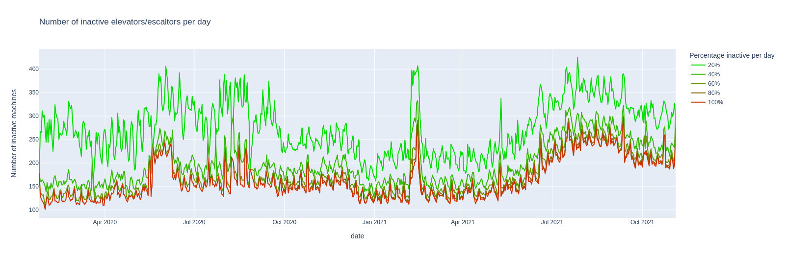
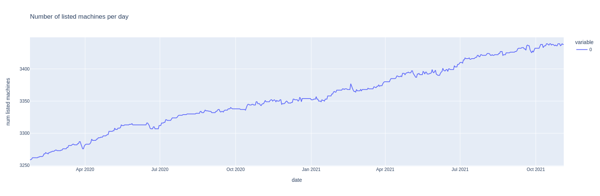
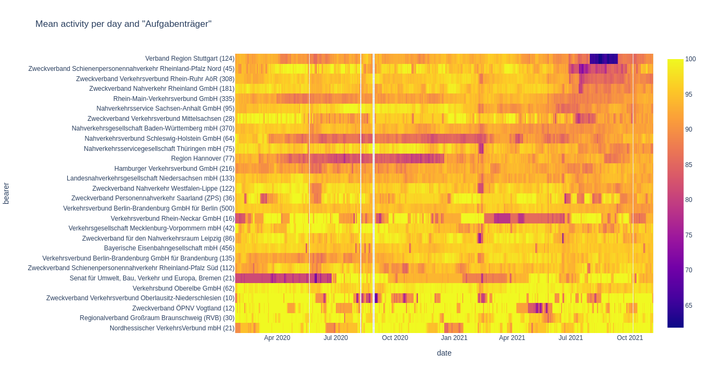
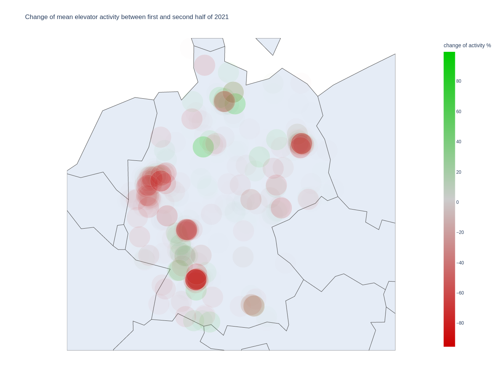
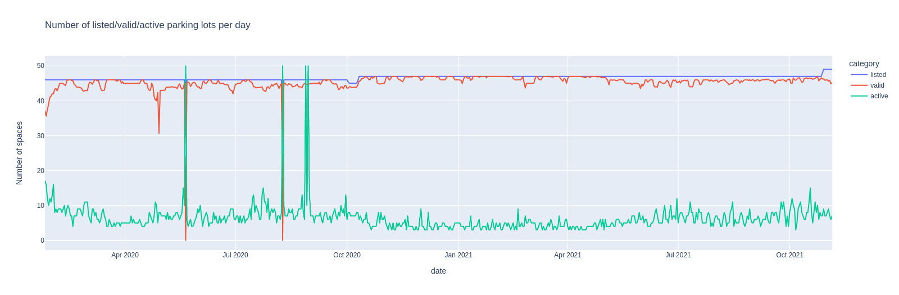
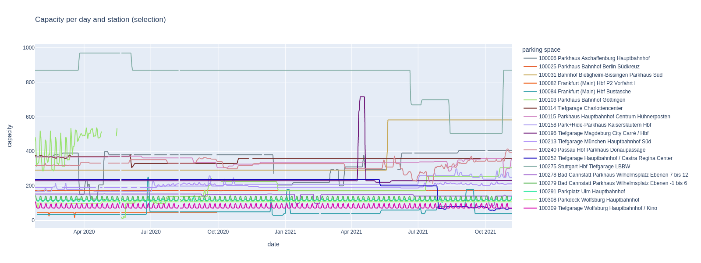
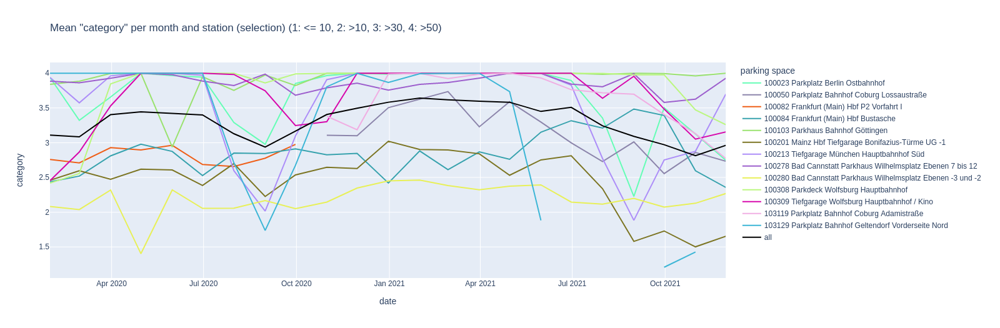
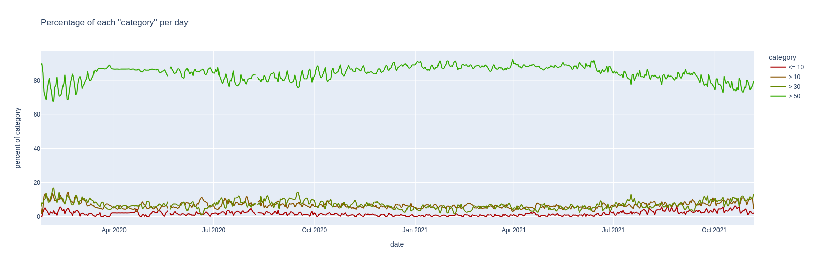
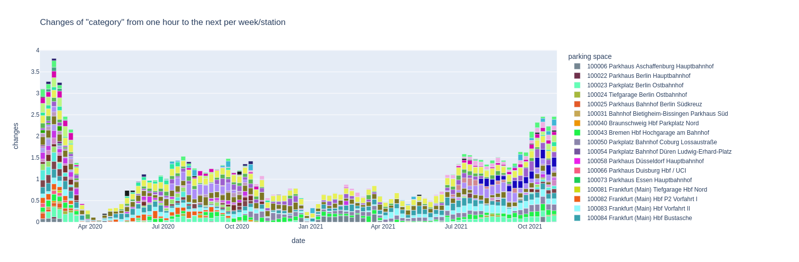
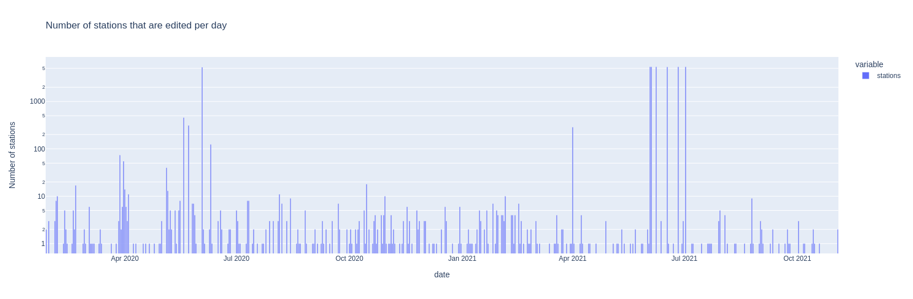

# Deutsche Bahn API History 

There was this [monumental talk](https://media.ccc.de/v/36c3-10652-bahnmining_-_punktlichkeit_ist_eine_zier)
in late 2019 about the *correctness* of the punctuality statistics published by
Deutsche Bahn, which got me interested in [api.deutschebahn.com](https://api.deutschebahn.com).

This repo contains non of the train schedule data. Instead it has change-logs of the
[parking api](https://developer.deutschebahn.com/store/apis/info?name=BahnPark&version=v1&provider=DBOpenData),
[station data api](https://developer.deutschebahn.com/store/apis/info?name=StaDa-Station_Data&version=v2&provider=DBOpenData)
and the [station facilities status api](https://developer.deutschebahn.com/store/apis/info?name=FaSta-Station_Facilities_Status&version=v2&provider=DBOpenData)
(status of elevators and escalators), **collected since late January 2020**.

Everything is browsable in the [static data page](https://defgsus.github.io/bahn-api-history/).


## Summary

Each table shows the top-ten most-changed objects.

### free parking lots
 
**50** objects, **60,708** snapshots, **47,936** changes (2020-01-25 23:27:15 - 2022-03-26 01:00:01)

|     id | name                                                     |   num changes |
|-------:|:---------------------------------------------------------|--------------:|
| 100054 | Düren P1 Parkplatz Ludwig-Erhardt-Platz                  |          6194 |
| 100084 | Frankfurt (Main) Hbf Bustasche                           |          4310 |
| 100201 | Mainz Hbf P3 Tiefgarage Bonifazius-Türme UG -1           |          3890 |
| 100083 | Frankfurt (Main) Hbf P3 Vorfahrt II                      |          3872 |
| 100280 | Bad Cannstatt P3 Parkhaus Wilhelmsplatz Ebenen -3 und -2 |          2989 |
| 100279 | Bad Cannstatt P2 Parkhaus Wilhelmsplatz Ebenen -1 bis 6  |          2515 |
| 100023 | Berlin Ostbahnhof P1 Parkplatz                           |          1933 |
| 100291 | Ulm Hbf P2 Parkplatz                                     |          1845 |
| 100090 | Freiburg (Breisgau) Hbf P1 Tiefgarage am Bahnhof         |          1771 |
| 100066 | Duisburg Hbf P2 Parkhaus UCI                             |          1569 |

### elevator status
 
**3,799** objects, **13,515** snapshots, **388,328** changes (2020-01-25 23:16:01 - 2022-03-26 01:01:01)

|       id | name                                                 |   num changes |
|---------:|:-----------------------------------------------------|--------------:|
| 10556568 | Tuttlingen ELEVATOR zum Gleis 4/5                    |          1458 |
| 10556567 | Tuttlingen ELEVATOR zum Gleis 2/3                    |          1454 |
| 10556569 | Tuttlingen ELEVATOR zu Gleis 1                       |          1434 |
| 10248843 | Regensburg Hbf ESCALATOR von Empfangshalle zu Brücke |          1169 |
| 10248859 | Regensburg Hbf ESCALATOR von Empfangshalle zu Brücke |          1115 |
| 10354470 | Osnabrück Hbf ELEVATOR zu Gleis 1                    |          1112 |
| 10417241 | Osnabrück Hbf ELEVATOR zu Gleis 4/5                  |          1101 |
| 10460422 | Diepholz ELEVATOR zu Gleis 2/3                       |          1096 |
| 10417240 | Osnabrück Hbf ELEVATOR zu Gleis 2/3                  |          1091 |
| 10466017 | Laupheim West ELEVATOR zu Gleis 2/3                  |          1086 |

### stations
 
**5,405** objects, **753** snapshots, **61,610** changes (2020-01-27 12:43:06 - 2022-03-25 07:05:01)

|   id | name                         |   num changes |
|-----:|:-----------------------------|--------------:|
| 6714 | Westerland (Sylt)            |            22 |
| 1947 | Friedrichshafen Stadt        |            20 |
| 8192 | Flughafen BER - Terminal 1-2 |            20 |
| 1906 | Freilassing                  |            19 |
| 3631 | Leipzig Hbf                  |            19 |
| 4234 | München Hbf                  |            19 |
| 1400 | Düsseldorf Flughafen         |            18 |
| 1821 | Berlin-Schönefeld Flughafen  |            18 |
| 1859 | Frankfurt (Oder)             |            18 |
| 2514 | Hamburg Hbf                  |            18 |


## Data

The APIs are sampled with separate cronjobs running these shell commands:

```shell script
# parking each 15 minutes
curl -X GET --header "Accept: application/json" \
    --header "Authorization: Bearer <YOUR_API_TOKEN>" \
    "https://api.deutschebahn.com/bahnpark/v1/spaces/occupancies" \
    > `date -Is -u`.json

# stations once a day
curl -X GET --header "Accept: application/json" \
    --header "Authorization: Bearer <YOUR_API_TOKEN>" \
    "https://api.deutschebahn.com/stada/v2/stations?searchstring=*" \
    > `date -Is -u`.json

# elevators each hour
curl -X GET --header "Accept: application/json" \
    --header "Authorization: Bearer <YOUR_API_TOKEN>" \
    "https://api.deutschebahn.com/fasta/v2/facilities?type=ESCALATOR,ELEVATOR"
    > `date -Is -u`.json
```
This simple setup does no error handling. If the endpoint is temporarily busy
the snapshot is lost.

Each API response is a list of objects which look like:

### parking

```json
{
  "allocation": {
    "validData": true,
    "capacity": 133,
    "category": 4,
    "text": "> 50"
  },
  "space": {
    "id": 100291,
    "label": "P2",
    "name": "Parkplatz Ulm Hauptbahnhof",
    "nameDisplay": "Ulm Hbf P2 Parkplatz",
    "station": {
      "id": 6323,
      "name": "Ulm Hbf"
    },
    "title": "Ulm Hbf P2 Ulm Hbf P2 Parkplatz"
  }
}
``` 

> Note that the original objects did contain a `timestamp` and `timeSegment` field.
> There are discarded in the changelogs to minimize the amount of data.


### stations

```json
{
  "aufgabentraeger": {
    "name": "Nahverkehrsservicegesellschaft Thüringen mbH",
    "shortName": "NVS"
  },
  "category": 6,
  "evaNumbers": [
    {
      "geographicCoordinates": {
        "coordinates": [11.593783, 50.93692],
        "type": "Point"
      },
      "isMain": true,
      "number": 8011058
    }
  ],
  "federalState": "Thüringen",
  "hasBicycleParking": true,
  "hasCarRental": false,
  "hasDBLounge": false,
  "hasLocalPublicTransport": true,
  "hasLockerSystem": false,
  "hasLostAndFound": false,
  "hasMobilityService": "no",
  "hasParking": false,
  "hasPublicFacilities": false,
  "hasRailwayMission": false,
  "hasSteplessAccess": "partial",
  "hasTaxiRank": false,
  "hasTravelCenter": false,
  "hasTravelNecessities": false,
  "hasWiFi": false,
  "mailingAddress": {
    "city": "Jena",
    "street": "Spitzweidenweg 28",
    "zipcode": "07743"
  },
  "name": "Jena Saalbf",
  "number": 3044,
  "priceCategory": 6,
  "regionalbereich": {
    "name": "RB Südost",
    "number": 2,
    "shortName": "RB SO"
  },
  "ril100Identifiers": [
    {
      "geographicCoordinates": {
        "coordinates": [11.593348001, 50.936519303],
        "type": "Point"
      },
      "hasSteamPermission": true,
      "isMain": true,
      "rilIdentifier": "UJS"
    }
  ],
  "stationManagement": {
    "name": "Chemnitz",
    "number": 115
  },
  "szentrale": {
    "name": "Erfurt Hbf",
    "number": 50,
    "publicPhoneNumber": "0361/3001055"
  },
  "timeTableOffice": {
    "email": "DBS.Fahrplan.Thueringen@deutschebahn.com",
    "name": "Bahnhofsmanagement Chemnitz"
  }
}
```

### elevators

```json
{
  "description": "zu Gleis 1",
  "equipmentnumber": 10354738,
  "geocoordX": 11.5873405,
  "geocoordY": 50.924981,
  "state": "ACTIVE",
  "stateExplanation": "available",
  "stationnumber": 3043,
  "type": "ELEVATOR"
}
```

## Change logs

The change-logs are collected in json files per year in [docs/data/](docs/data) 
using a self-baked format which does not contain too much space and allows committing 
new json lines with minimal diffs. 

All object keys are sorted alphabetically to avoid needless commit diffs.

To get access to all objects via python:
```python
from src.changelog_reader import ChangelogReader

for changelog_file, dates_file in ChangelogReader.get_changelog_files("stations"):
    reader = ChangelogReader(changelog_file, dates_file)
    for object_id in reader.object_ids():
        for timestamp, data in reader.iter_object(object_id):
            print(f"object {object_id} at time {timestamp} is {data}")
```

If an object was not listed during a snapshot, `data` will be `None`. 

The `reader.iter_object(object_id)` method iterates through all changes of the 
object. The `reader.iter_object_snapshots(object_id)` method iterates through 
each snapshot regardless if the object is changed or does not yet exist.


## Some graphics

Below are some plots and crude analysis of the data. The jupyter notebooks 
used for it are in the [notebooks/](notebooks/) directory.  

### elevators 

Counting the number of elevators and escalators that do not have state
`ACTIVE` produces this interesting curve:



The different colors represent the amount of time that these machines where
inactive, 100% meaning it was inactive the whole day.

The small repeating pikes align with the working days each week. This is
probably caused by a mixture of two things: Elevators might tend to break more often 
when used, and there are certainly more reports/complaints about defect machines
on workdays, compared to the weekends.

There seems to be a *bad* trend visible. The number of defect machines is growing.
How many machines are there anyways? Plotting the number of listed IDs per day..



..reveals that there are 200 new devices since beginning of 2020. That is a bigger
increase than the increase of the number of defect devices over the same period. 
Something else is going on...

Each elevator/escalator device has a `stationnumber` attached. From the station data
we can get a couple of meta information. After trying a few of them, the 
`aufgabentraeger` entry seems to relate somewhat with the inactivity during 
the second half of 2021:



In the above plot, the y axis has been sorted by mean activity during late 2021. 
*Verband Region Stuttgart* is the main cause of trouble, followed by a couple of
Rhineland-ian associations. The number behind the labels shows the overall number 
of devices of each *Aufgabenträger*. If *Verband Region Stuttgart* drops from 
about 90% to 64% mean activity per day through the period of Aug. 2021 to mid September
that's quite something. 

I completely don't know Stuttgart by detail so can only guess about. There's this 
[construction site](https://www.bahnprojekt-stuttgart-ulm.de/presse/pressemitteilungen/newsdetail/news/1489-veraenderte-wegefuehrung-am-stuttgarter-hbf/newsParameter/detail/News/datum/20190704/).
at the main station which perfectly matches the date. Only that *Stuttgart Hauptbahnhof*
belongs to *Nahverkehrsgesellschaft Baden-Württemberg mbH* and they don't show that
dropout of activity.`
 
Plotting the change of device activity between early and late 2021 per geo-position
makes the finger-pointing even easier:
 


I admit, there are a lot of elevators in the Rhineland (west) and i wouldn't want
to manage them all. Stuttgart is the big spot in the south-west, 
Berlin (east) and Hamburg (north) also seem to have evolved ongoing problems.


### parking

The parking data is a little bit lame. Instead of actual numbers of free spots there
is only a `category` that says:

1. 0 to 10
2. 11 to 30
3. 31 to 50
4. 51 to maximum capacity

First of all, here's the number of places for each day that are 
 - **listed**: included in the API response list 
 - **valid**: have the `validData` flag and contain a value for `category`
 - **active**: a change of `category` was recorded during that day



The idea of approximating the *percentage of occupation* using the category
and the capacity becomes less attractive when looking at the capacity changes
over time:



It's quite hard to explain what's going on there. Some parking lots seem to change
their maximum capacity regularly every other weekday. Some of them 
temporarily loose capacity, maybe because of construction sites and some seem
to mix up their occupation data with the capacity data. Other parking lots 
seem to grow immensely during a couple of days, or people just type in wrong
numbers and some else corrects them? 

In face of this totally erratic data, let's just look at pure `category` numbers:
 


The plot shows only stations with a certain amount of activity and 
the black line shows the average of these stations. 
Except for late summer (Aug. to Oct.) there does not seem to be happening much.
Or in other words, the parking lots do not change 
their average `category` per month a lot. Also the plot is pretty much unreadable. 

We can also look at the percentage of how much each category is listed. This time
per day and for all stations:
 


One very significant impact which is visible here is the corona lock-down which
happened in Germany at about 16th of March 2020, which is exactly the beginning
of the flat area in the upper green line representing the `> 50` category.

Apart from the category which somehow represents the **number** of free spaces 
we can simply plot the amount of change. This might go as a measure of
general activity. Below is plotted the mean absolute difference of
the category value between two hours, shown as average per week and space:



You know, just by looking at that one must judge that *the pandemic* is still going on. 


### stations

The number of changes to station data per day tells us that the data monkeys 
are somewhat busy:



There is only one snapshot stored each day, so the 
number of stations edited per day is equal to the number of all edits per day.
Also note, that for some stupid reason i setup the cronjob to 7 AM. Unless
the data monkeys where up early or working through the night, the changes 
have probably occurred the day before the snapshot! However, i won't change 
the snapshot time for consistency.  

Some particular dates jump out of the above graph where more than 5000 
stations are edited during the same day. Here's a list of the top-five
changes for each of these dates. 

- **`2020-06-03`**
  - 5455 x replace `ril100Identifiers.geographicCoordinates.coordinates.0`
  - 5454 x replace `ril100Identifiers.geographicCoordinates.coordinates.1`
  - 9 x add `ril100Identifiers.geographicCoordinates`
  - 1 x replace `localServiceStaff.availability.friday.fromTime`
  - 1 x replace `localServiceStaff.availability.friday.toTime`
- **`2021-06-03`**
  - 5399 x remove `hasSteplessAccess`
  - 5399 x replace `federalState`
  - 5399 x replace `regionalbereich.shortName`
  - 5371 x remove `timeTableOffice`
  - 267 x replace `ril100Identifiers.isMain`
- **`2021-06-04`**
  - 5399 x add `hasSteplessAccess`
  - 5399 x add `timeTableOffice`
  - 5399 x replace `federalState`
- **`2021-06-08`**
  - 5664 x replace `ril100Identifiers.isMain`
  - 5458 x replace `evaNumbers.isMain`
  - 1 x replace `mailingAddress.street`
  - 1 x replace `evaNumbers.4.isMain`
  - 1 x replace `ril100Identifiers.4.isMain`
- **`2021-06-17`**
  - 5464 x replace `ril100Identifiers.geographicCoordinates.coordinates.0`
  - 5463 x replace `ril100Identifiers.geographicCoordinates.coordinates.1`
  - 61 x add `ril100Identifiers.geographicCoordinates`
  - 3 x replace `mailingAddress.street`
  - 1 x replace `ril100Identifiers.4.geographicCoordinates.coordinates.0`
- **`2021-06-26`**
  - 5399 x replace `ril100Identifiers`
- **`2021-07-02`**
  - 5399 x replace `ril100Identifiers`
  - 5397 x replace `evaNumbers.isMain`

First of all, June 3rd (or probably June 2nd) seems to be the traditional day
to publish updated geo-coords for all stations. In 2021 a couple of major update 
sessions followed after June 3rd, e.g. the `federalState` was replaced
with abbreviations, which got reverted again, and things got 
removed and reappeared later. 